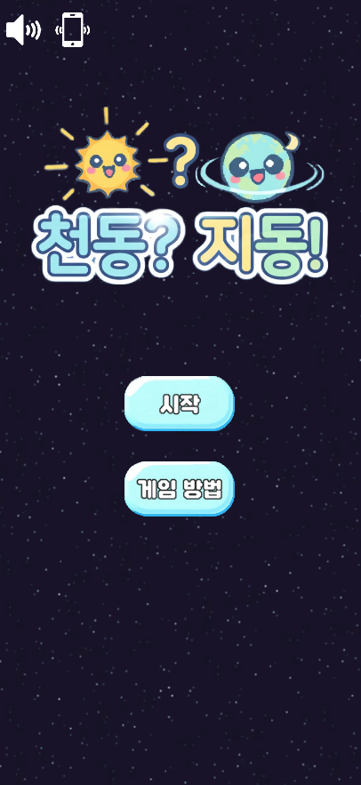
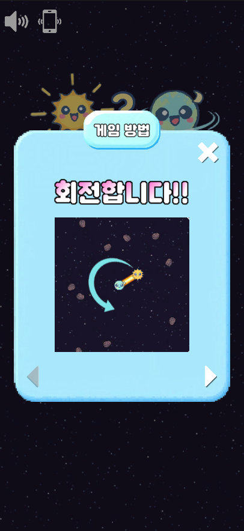
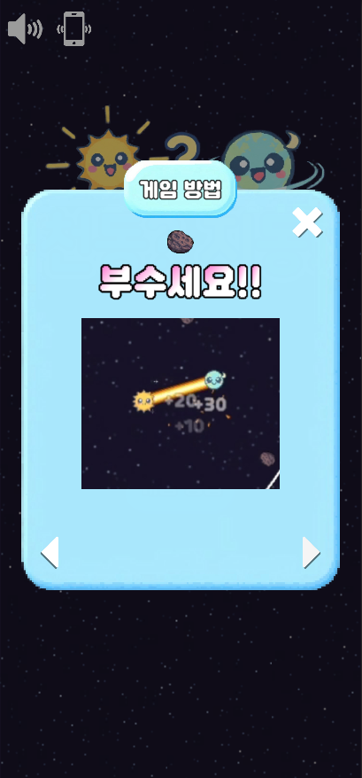
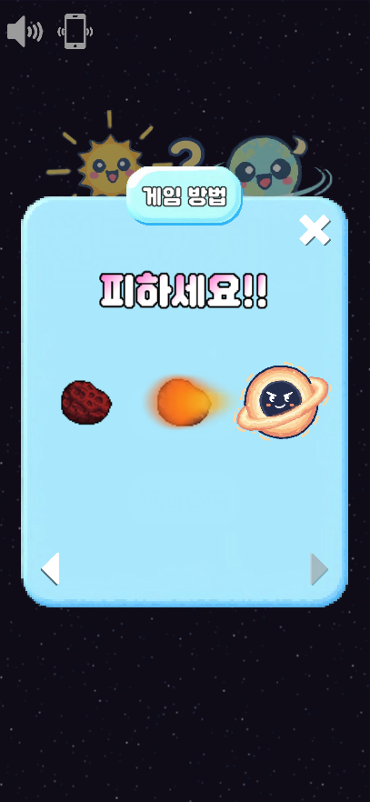
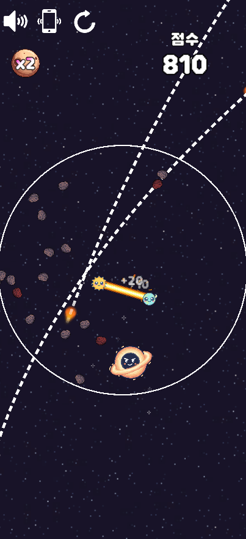
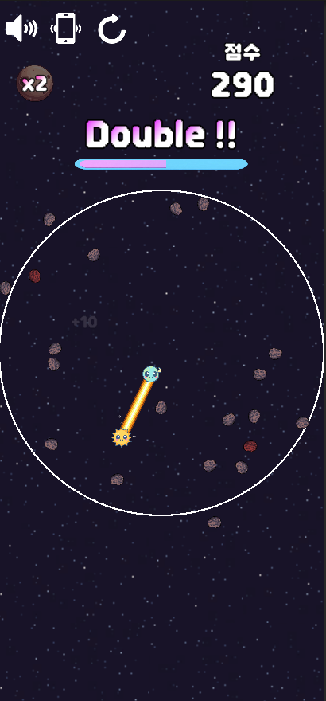
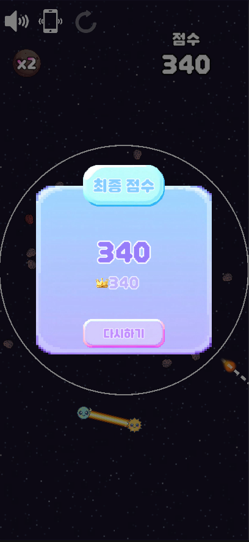

# GeoHelio — 2D 하이퍼 캐주얼 모바일 게임

## 프로젝트 소개

2D 하이퍼 캐주얼 모바일 게임으로, 지구와 태양을 잇는 광선을 회전시켜 소행성을 파괴하고 점수를 획득합니다. 기본은 지구 중심 공전이며, 화면을 탭할 때마다 회전 중심이 지구 ↔ 태양으로 전환됩니다. 단순한 조작으로 깊이 있는 점수 시스템과 리스크·보상의 균형을 제공합니다.

## 프로젝트 개요

- 개발 기간: 진행 중
- 인원/역할: 1인 (기획/프로그래밍/아트)
- 장르/플랫폼: 하이퍼 캐주얼 · 아케이드 / 모바일(iOS/Android)
- 핵심 메커니즘: 탭으로 회전 중심 전환(지구 ↔ 태양), 광선 회전으로 소행성 파괴 및 점수·콤보 획득, 거리(반지름) 관리, 중심이 원형 영역을 벗어나면 게임오버

## 사용 기술

- 엔진: Unity 6000.2.1f1
- 언어/패키지: C#, UniTask 라이브러리
- 버전관리/환경: Git, VSCode
- 그래픽/아트 툴: Aseprite

## 주요 기능

- 중심 전환: 탭 입력마다 회전 중심이 지구 ↔ 태양으로 전환
- 광선 파괴/점수: 광선에 닿은 소행성 파괴 및 점수 획득, 동일 중심 유지 콤보에 따라 보너스 점수
- 거리(반지름) 시스템: 소행성 파괴 시 증가, 시간이 지날수록 자연 감소, 임계치 도달 시 게임오버
- 오브젝트 스폰: ObjectSpawner 단일 클래스에서 스폰 반경·주기·밀도(현재 소행성 수 기반) 등을 제어하여 오브젝트 스폰/디스폰을 중앙화. 페이드 인/아웃 연출로 자연스러운 등장/퇴장을 구현
- 오디오/진동: 상황별 SFX 트리거, 오디오/진동 토글
- 데이터: 최고 점수 저장/로드, UI와 실시간 동기화(점수/게임오버 패널)

## 영상 & 스크린샷

- YouTube: 
- 스크린샷:
  
  
  
  
  
  
  

## 주요 폴더 구조

- `Assets/Scripts`: 런타임 스크립트
  - `Game`: `GameManager`, `ObjectSpawner`, `Asteroid` 등 게임 진행/스폰 로직
  - `Player`: `PlayerController`(회전 중심 전환/거리 관리)
  - `UI`: `UIManager`, `ScorePanel`, `GameOverPanel`, `TopLeftButtons`
  - `Utilities`: `AudioManager`, `SfxCatalog`, `DataManager`, `VibrationManager`, `GameConstants`
- `Assets/Prefabs`: 프리팹 리소스(플레이어/소행성/장애물 등)
- `Assets/Scenes`: `Main`, `Game` 등 씬
- `Assets/Audio`: BGM/SFX 리소스
- `Assets/Animation`: 애니메이션 클립/컨트롤러
- `Assets/Sprites`: 2D 스프라이트 리소스
- `Assets/Shaders & Materials`: 커스텀 셰이더/머티리얼
- `Assets/Editor`: 에디터 전용 스크립트

## 아키텍처 / 구조

- GameManager: 게임 상태/점수/시간/콤보/거리 관리, 시작·일시정지·종료 제어, 이벤트 발행
- PlayerController: 회전 중심 전환(지구/태양), 현재 중심/거리 갱신, 중심 전환 이벤트 발행
- ObjectSpawner: 초기 배치/주기 스폰/디스폰 반경 계산, 장애물/소행성 생성·정리
- Asteroid/BlackHole 등 오브젝트: 충돌/파괴/흡인 등 개별 동작과 이펙트 처리
- UI 레이어: `UIManager`(전체), `ScorePanel`(점수 포맷/표시), `GameOverPanel`(결과 표시)
- 시스템 유틸: `AudioManager`(BGM/SFX), `SfxCatalog`(키 매핑), `DataManager`(최고 점수 저장), `VibrationManager`(진동)

## 배운 점 & 개선 방향

- 배운 점: 궤도 수학·거리 감쇠/보상 설계, 이벤트 기반 상태 전이, UniTask 기반 비동기 플로우, 모바일 입력 특성 대응
- 아쉬운 점: 난이도 곡선/밸런스 조정 필요, 다양한 장애물·아이템 종류 확장 여지, 플레이어 재화 및 광고를 통한 플레이어 재화 지급 미구현
- 개선 계획: 더욱 다양한 아이템/버프 시스템, 장애물 패턴 추가, 플레이어 재화 구현

## 외부 에셋 및 리소스 정보

### 폰트

- 던파 비트비트체 - https://df.nexon.com/data/font/dnfbitbitv2

### 스프라이트

- Yet Another Icons by Prinbles - https://prinbles.itch.io/yet-another-icons
- Void - Environment Pack by Foozle - https://foozlecc.itch.io/void-environment-pack
- Space by PiiiXL - https://piiixl.itch.io/space
- 2d PixelArt Stars - https://s-a-t-u-r-n.itch.io/2d-pixelart-stars

### 오디오

- FREE Music Loop Pack for Game Jam and Prototype - https://tubelesshalo.itch.io/free-music-loop-pack
- Fun Casual Sounds - https://assetstore.unity.com/packages/audio/sound-fx/fun-casual-sounds-64048?aid=1011l5f3d&pubref=chrome
